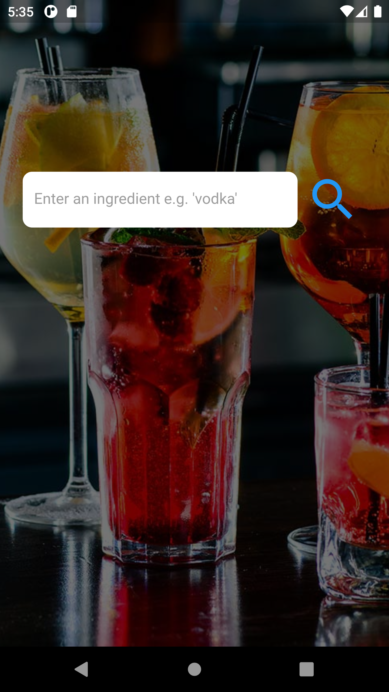
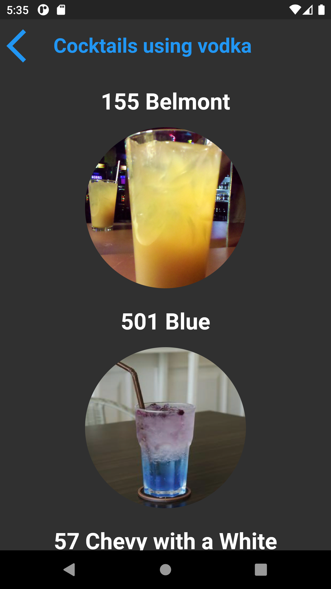

# cocktail_search
Simple Flutter/Dart application which makes use of the cocktaildb API to allow the user to search for any cocktail ingredient (eg vodka, rum) and view a list of possible cocktails.
***

***

***

